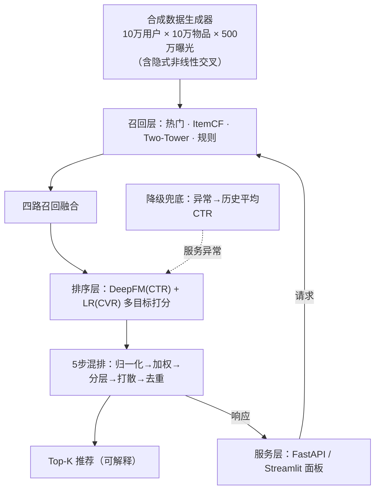

# AeroRec · 出行智能推荐中台

> 面向出行消费场景（机票 / 酒店 / 商城 / 营销 / 直播）的开源智能推荐中台。
> 工程化复现工业级推荐链路：**召回 → CTR 动态排序 → 降级兜底 → 服务化 → 可解释 → 真实 CTR 评估**。
> 本科 AI 出国申请作品 · 工程型 · 交叉学科（AI + 出行/交通）

[](https://www.python.org/)
[](LICENSE)
[](https://huggingface.co/spaces)
[](https://elijah-lin-dancer.github.io/AeroRec/)

> **快速体验**：[项目主页](https://elijah-lin-dancer.github.io/AeroRec/) · [交互 Demo（HF Spaces）](https://huggingface.co/spaces)

---

## 背景与动机

出行类 App（机票、酒店、辅营）的核心增长杠杆之一是**个性化推荐中台**：在首页、会员中心、行程页等位置，
把"对的商品"在"对的坑位"推给"对的用户"。工业实践中，这与多品类混排、CTR 动态排序、服务降级、A/B 实验密不可分。

本项目**受工业实习中的推荐中台工程实践启发**，用一个**可复现的合成数据集**演示完整工程链路，
便于评审者一键运行、审阅与复现。**本项目不使用、也不声称使用任何真实业务数据。**

## 核心功能

- [x] 多场景推荐：航线 / 酒店 / 商城 / 营销 / 直播 五大类目混排
- [x] 热门兜底召回 + 物品协同过滤（ItemCF）召回基线
- [x] Two-Tower 向量召回（PyTorch 双塔 + 负采样）
- [x] 规则召回：里程兑换 / 里程票零库存 / 常驻地热门航线 / 多段行程优先返程
- [x] 四路召回融合（位置分加权 + 降级兜底）
- [x] 轻量特征库：集中产出召回 / 排序 / 冷启动共用特征（dense + sparse）
- [x] CTR 动态排序：归一化 → CTR 加权 → 分层排序 → 同品类打散 → 分页去重
- [x] DeepFM 排序模型（PyTorch，FM + DNN）
- [x] 降级兜底：CTR 服务超时 → 历史平均 CTR 兜底
- [x] 离线评估：LR vs DeepFM 的 AUC 对比 + 推荐列表真实 CTR 对比
- [x] 服务化 API（FastAPI：推荐 / 排序流程 / A/B）
- [x] 可解释面板（Streamlit：推荐演示 / 排序流程 / A/B 报告）
- [x] 模拟 A/B 报告（多目标 CTR+CVR，点击率 / 转化率双提升）
- [x] **真实 CTR 口径评估 + Oracle 上界**（修正热门基线的平滑稀疏偏差，结论可引用）
- [x] 双档数据规模：`full`（10 万用户 × 10 万物品）与 `lite`（2 万 × 2 万，供 2GB 内存的在线 Demo）
- [x] 在线 Demo：GitHub Pages 项目主页 + Hugging Face Spaces 交互面板
- [ ] demo 视频（30 秒录屏）

## 系统架构



## 快速开始

```bash
pip install -r requirements.txt
python -m src.pipeline_demo        # 数据 + 四路召回 + 融合 + 样例推荐
python -m src.eval.evaluate        # LR vs DeepFM AUC + 真实 CTR 对比 + Oracle 上界
streamlit run app.py               # 交互式 Demo（推荐 / 排序流程 / A/B 报告），默认 lite 档
AEROREC_MODE=full streamlit run app.py   # 用 full 档跑（需 ~1.5GB 内存）
uvicorn src.serve.app:app --port 8000    # FastAPI 服务（推荐 / 排序流程 / A/B）
python -m pytest tests/ -q         # 冒烟测试（16 项）
```

### 在线 Demo

- **项目主页（GitHub Pages）**：https://elijah-lin-dancer.github.io/AeroRec/
- **交互面板（Hugging Face Spaces）**：见仓库 README 顶部徽章

## 数据与复现

数据由 `src/data/synthetic_generator.py` 生成（固定随机种子，可一键复现）：

- **物品**：5 类目共 100,000 个（每类目 2 万），各带质量分 `quality`、现金价、里程价、出发/到达城市、航班时段、库存。
- **用户**：100,000 个，对各品类有亲和度 `aff_*`，附里程余额、常驻城市、价格敏感度、商务标签。
- **未来行程**：约 14.8 万条，支撑"多段行程按日期优先返程"等出行业务规则。
- **曝光日志**：500 万条，每条按"潜在真实 CTR"抽样点击、点击后按 CVR 抽样转化。

因已知潜在真实 CTR，离线评估（AUC、真实 CTR）具备可比性。

### 两档规模

| 档位 | 配置 | 规模 | 峰值内存 | 用途 |
|---|---|---|---|---|
| `full` | `src/config.py` | 10 万用户 × 10 万物品 × 500 万曝光 | ~1.5GB | 本地完整复现、论文级结果 |
| `lite` | `src/config_lite.py` | 2 万用户 × 2 万物品 × 100 万曝光 | ~0.9GB | 在线 Demo（HF Spaces 免费档 2GB） |

`lite` 档与 `full` 档**共用同一套算法代码**（`Mixer` / `DegradeRanker` / `simulate_ab` / `compare_rankers` 全部复用），
仅数据规模与特征库实现不同（`lite` 走纯 numpy 路径，规避 pandas/pyarrow 的额外内存开销）。
`lite` 档的数值**仅供 Demo 演示**，可引用结论以 `full` 档为准。

切换方式：环境变量 `AEROREC_MODE=lite|full`（默认 `lite`）。

## 方法

1. **召回（已完成）**：热门兜底 + ItemCF + Two-Tower 向量召回 + 出行规则召回，四路融合产出候选集。
2. **排序（已完成）**：复刻工业 5 步流程——分数归一化 → CTR 加权 → 分层排序 → 同品类打散 → 分页去重；CTR 模型为 DeepFM（PyTorch）。
3. **降级（已完成）**：CTR 服务超时 → 降级为历史平均 CTR 兜底，保证核心链路不挂。

## 离线评估结果（受控合成实验）

### ① CTR 模型 AUC（测试集 6 万样本）

| 模型 | AUC |
|---|---|
| Logistic Regression | 0.7421 |
| **DeepFM** | **0.8024**（+6.0pp） |

DeepFM 的 FM/DNN 能自动学出数据中的隐式非线性交叉（价格敏感×低价、商务×早班机、里程契合），
因此显著优于线性 LR。**模型只能拿到原始特征，交叉需自行学习**——此设计明确标注为受控实验设置。

### ② 可引用结论：真实 CTR 口径 + Oracle 上界

> **为什么不用「模拟 A/B 的 +18.9%」作为主结论？**
> 热门基线按「历史日志的**贝叶斯平滑 CTR**（α=5）」排序，而日志是**随机曝光**生成的：
> 曝光次数少的物品偶然被点击一次，平滑 CTR 就被严重高估（α=5 压不住这种噪声）。
> 完整档实测：热门榜 top200 **平滑 CTR = 0.6231** vs **真实 CTR = 0.2528**（**偏差 +0.37**），
> 平滑榜 top10 与真实 CTR top10 仅重合 **2/10**。这层稀疏性偏差会让热门基线在模拟中「表现变差」，
> 从而**高估**实验组增益。因此本项目同时给出下面这套**不依赖任何平滑估计**的口径。

**真实 CTR 口径**（直接用已知的潜在真实 CTR 计算各方法 Top-K 列表的平均点击率，100 用户、Top-10）：

| 方法 | 平均真实 CTR | 相对热门 | 占 Oracle 上界 |
|---|---|---|---|
| 随机（下界参照） | 0.1652 | -66.4% | 23.4% |
| 热门（工业常用基线） | 0.4922 | — | 69.7% |
| **DeepFM + 多目标混排** | **0.6032** | **+22.6%** | **85.4%** |
| Oracle 上界（候选池最优） | 0.7059 | +43.4% | 100% |

**Oracle 上界怎么构造的**：池 = 热门候选 ∪ 规则候选 ∪ 3000 个随机物品，
在池内按**该用户的真实 CTR** 降序取 Top-K。池**必须包含其他方法的结局**，
否则 Oracle 不构成真正的上界——本项目第一版曾误用「全局平均真实 CTR 排序」，
结果退化成热门榜的变体（与 DeepFM 打平），已修正为逐用户候选池口径。

**结论**：DeepFM 多目标排序相对热门基线提升 **+22.6%**，达到理论上界的 **85.4%**，
即模型的收益已经接近候选空间所能提供的极限。该数字**可引用**，因为它不依赖任何有偏估计。

### ③ 参考：模拟在线 A/B（口径受限，仅供形式对照）

| 指标 | 对照组（热门） | 实验组（DeepFM+混排） | 提升 |
|---|---|---|---|
| 点击率 CTR | 0.519 | 0.618 | +18.9%（p<0.001） |
| 转化率（转化/曝光） | 0.191 | 0.227 | +18.8%（p<0.001） |

> ⚠️ 上表为**模拟**口径，其热门基线受上述平滑稀疏偏差削弱，**增益被高估**，
> 故仅保留以展示工业 A/B 的形式（曝光 / 点击 / 显著性检验）。
> **对外引用请使用 ② 的真实 CTR 口径。**

## 目录结构

```
src/
  config.py              全局配置（full 档）
  config_lite.py         轻量档配置（继承 full，仅覆盖规模）
  data/synthetic_generator.py      合成数据生成器（pandas 路径，full 档）
  data/synthetic_generator_lite.py 纯 numpy 生成器（lite 档，低内存）
  feature/store.py             轻量特征库（full 档）
  feature/lite_store.py        特征库 numpy 实现（lite 档）
  recall/baselines.py          热门 + ItemCF 召回
  recall/two_tower.py         Two-Tower 向量召回
  recall/rule.py              出行规则召回（里程 / 多段行程）
  recall/fusion.py            多路召回融合
  rank/deepfm.py              DeepFM 排序模型
  rank/trainer.py             CTR 训练器
  rank/mixer.py               5 步混排
  rank/degrade.py             降级兜底
  eval/metrics.py             离线指标
  eval/evaluate.py            LR vs DeepFM AUC + 真实 CTR 对比 + Oracle 上界
  eval/ab.py                  模拟 A/B + compare_rankers（真实 CTR 口径）+ 偏差表
  serve/engine.py             推荐引擎（full 档）
  serve/engine_lite.py        推荐引擎（lite 档，复用混排/降级/评估）
  serve/app.py                FastAPI 服务
  app.py                      Streamlit 交互 Demo（根目录，支持 lite/full 切换）
tests/test_data.py         数据 / 特征 / 召回 冒烟测试
tests/test_rank.py         排序层 / 混排 / 降级 冒烟测试
tests/test_ab.py           模拟 A/B 冒烟测试
```

## 诚实边界

- 数据为本项目**合成**（受控实验），仅用于演示工程链路；不涉任何真实业务数据，也不与任何真实企业系统关联。
- 数据生成公式中注入了隐式非线性交叉项，用于让深度模型可学；模型只能拿到原始特征，交叉需自行学习——此设计明确标注为受控实验设置。
- CTR / 召回模型使用标准模型（scikit-learn / PyTorch 实现的 Two-Tower、DeepFM 等均为已有方法的实现），本项目**不提出新算法**。
- **评估口径透明化**：模拟 A/B 的增益受热门基线平滑稀疏偏差影响而被高估，
  故对外只引用「真实 CTR 口径 + Oracle 上界」的结论；偏差已量化并写入代码注释与评估脚本输出。
- 实习经历仅作为项目动机来源（业务规则与流程启发），实习中未涉及深度排序模型的训练。

## 待办（Roadmap）

- [x] W2：Two-Tower 召回 + 规则召回 + 召回融合
- [x] W3：DeepFM 排序 + 5 步混排流程 + 降级策略 + 离线评估（AUC / 真实 CTR）
- [x] W4：FastAPI 服务化 + 可解释面板（Streamlit）+ 模拟 A/B 报告
- [x] W5：评估口径修正（真实 CTR + Oracle 上界）、双档规模（lite 供在线 Demo）
- [ ] W6：demo 视频（30 秒）+ 复现文档定稿

---

*注：本文档随开发推进更新，勾选项为已完成模块。*
